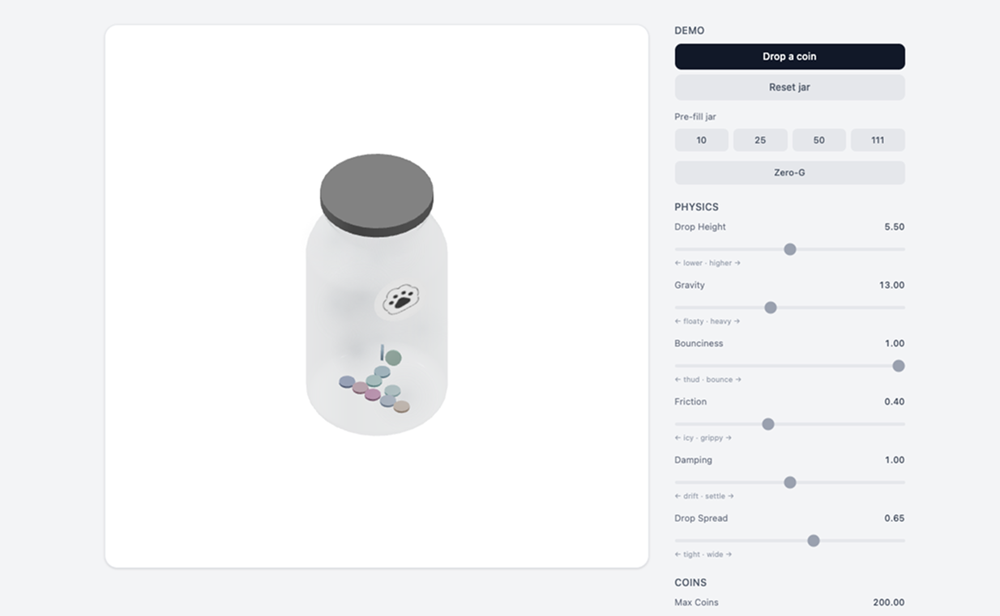

# Tip Jar Playground

Interactive 3D tip jar built with React Three Fiber and Rapier physics. Drop coins, tweak physics, customize visuals — all in the browser.

**[Try the live demo](https://baseddesigner.github.io/tip-jar-playground/)**



## Features

- Physics-simulated coins with Rapier 3D
- Glass jar with animated lid, fog particles, and avatar sticker
- Drop 1, 10, or 20 coins at a time, or pre-fill the jar
- Adjustable physics (gravity, bounce, friction, damping, drop spread)
- Visual controls (coin size, metalness, jar opacity, fog)
- Zero-G mode
- Camera controls with JSON import/export
- Custom sticker upload

## Getting started

```bash
git clone https://github.com/baseddesigner/tip-jar-playground.git
cd tip-jar-playground
npm install
npm run dev
```

Open [http://localhost:5173/tip-jar-playground/](http://localhost:5173/tip-jar-playground/) in your browser.

## Tech

- [React Three Fiber](https://docs.pmnd.rs/react-three-fiber) + [Rapier](https://rapier.rs/) for 3D physics
- [drei](https://github.com/pmndrs/drei) for camera and textures
- Vite + TypeScript + Tailwind CSS v4

## Build

```bash
npm run build
```

Deploys to GitHub Pages automatically on push to `main`.

---

Built by [@baseddesigner](https://github.com/baseddesigner) · Powering [pawr.link](https://pawr.link)
